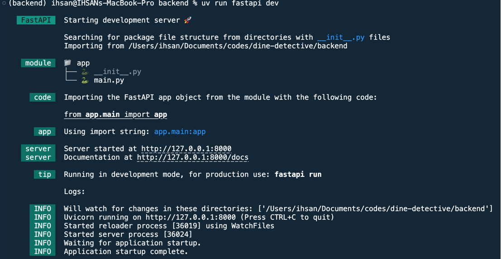

# Guide to Run Backend Locally

First, make sure you have `uv` installed globally. If not, you can visit [https://docs.astral.sh/uv/](https://docs.astral.sh/uv/).

To install all dependencies, run the command:

```sh
uv sync
```

This will install all dependencies.

To run the backend, use the command:

```sh
uv run fastapi dev
```

You will see something like:



For Swagger documentation, visit:

[http://127.0.0.1:8000/docs](http://127.0.0.1:8000/docs)

Start testing APIs!
